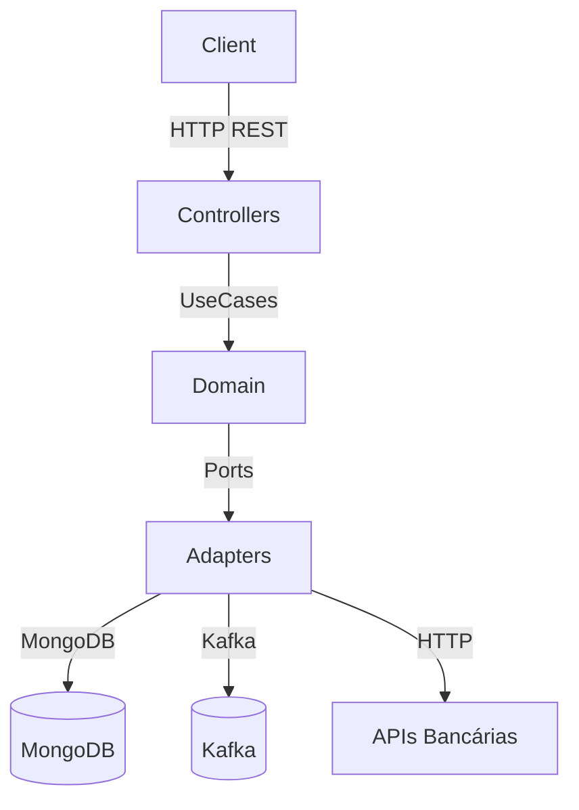
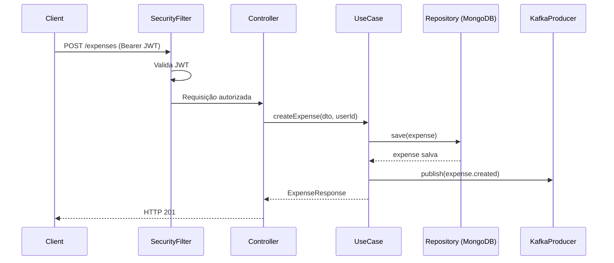

# Design Técnico — API REST de Controle de Despesas Pessoais

## Overview

A API REST de Controle de Despesas Pessoais é um serviço backend implementado em **Kotlin + Spring Boot 3.x** que permite a usuários autenticados registrar, consultar e importar despesas financeiras. O sistema adota **Arquitetura Hexagonal (Ports & Adapters)**, separando o domínio das dependências externas (MongoDB, Kafka, APIs bancárias).

Fluxo principal:
1. Usuário se registra e autentica via JWT.
2. Usuário cadastra despesas manualmente ou importa transações bancárias.
3. Eventos de negócio são publicados no Kafka de forma assíncrona.
4. Dados são persistidos no MongoDB.



---

## Architecture

O projeto segue a **Arquitetura Hexagonal** com três camadas principais:

```
src/main/kotlin/com/romullo/pereira/auth/auth/service/
├── domain/
│   ├── model/          # Entidades de domínio (User, Expense, Category)
│   ├── port/
│   │   ├── inbound/    # Interfaces dos casos de uso
│   │   └── outbound/   # Interfaces dos repositórios e serviços externos
│   └── exception/      # Exceções de domínio
├── application/
│   └── usecase/        # Implementações dos casos de uso
└── adapters/
    ├── inbound/
    │   └── rest/        # Controllers REST + DTOs de request/response
    └── outbound/
        ├── persistence/ # Repositórios MongoDB (Spring Data)
        ├── messaging/   # Kafka Producers e Consumers
        └── banking/     # Clientes HTTP para APIs bancárias externas
```

### Decisões Arquiteturais

- **MongoDB** em vez de PostgreSQL/Flyway (o `application.yml` atual usa PostgreSQL com Flyway, mas o README e os requisitos especificam MongoDB — o design segue os requisitos).
- **JWT HS256** com validade de 24h para autenticação stateless.
- **Kafka** para desacoplamento de eventos de negócio do fluxo REST síncrono.
- **Spring Security** para proteção dos endpoints e validação de tokens.
- **WebClient** (reativo) para chamadas às APIs bancárias externas, evitando bloqueio de threads.



---

## Components and Interfaces

### Inbound Ports (Use Case Interfaces)

```kotlin
// Auth
interface RegisterUserUseCase {
    fun register(email: String, password: String): UserResponse
}

interface AuthenticateUserUseCase {
    fun authenticate(email: String, password: String): TokenResponse
}

// Expenses
interface CreateExpenseUseCase {
    fun create(request: CreateExpenseRequest, userId: String): ExpenseResponse
}

interface ListExpensesUseCase {
    fun listByUser(userId: String): List<ExpenseResponse>
}

interface GetExpenseByIdUseCase {
    fun getById(id: String, userId: String): ExpenseResponse
}

// Categories
interface CreateCategoryUseCase {
    fun create(name: String, userId: String): CategoryResponse
}

interface ListCategoriesUseCase {
    fun listByUser(userId: String): List<CategoryResponse>
}

// Bank Integration
interface ImportBankTransactionsUseCase {
    fun import(userId: String): ImportResult
}
```

### Outbound Ports (Repository & Service Interfaces)

```kotlin
interface UserRepository {
    fun save(user: User): User
    fun findByEmail(email: String): User?
    fun existsByEmail(email: String): Boolean
}

interface ExpenseRepository {
    fun save(expense: Expense): Expense
    fun findByUserId(userId: String): List<Expense>
    fun findByIdAndUserId(id: String, userId: String): Expense?
    fun existsByExternalIdAndUserId(externalId: String, userId: String): Boolean
}

interface CategoryRepository {
    fun addCategory(userId: String, name: String)
    fun findByUserId(userId: String): List<String>
    fun existsByUserIdAndName(userId: String, name: String): Boolean
}

interface EventPublisher {
    fun publishExpenseCreated(event: ExpenseCreatedEvent)
    fun publishExpenseHighAlert(event: ExpenseHighAlertEvent)
    fun publishBankTransactionsImported(event: BankTransactionsImportedEvent)
}

interface BankApiClient {
    fun fetchTransactions(userId: String): List<BankTransaction>
}
```

### REST Controllers

| Controller | Endpoint | Método | Autenticado |
|---|---|---|---|
| `AuthController` | `/auth/register` | POST | Não |
| `AuthController` | `/auth/login` | POST | Não |
| `ExpenseController` | `/expenses` | POST | Sim |
| `ExpenseController` | `/expenses` | GET | Sim |
| `ExpenseController` | `/expenses/{id}` | GET | Sim |
| `CategoryController` | `/categories` | POST | Sim |
| `CategoryController` | `/categories` | GET | Sim |
| `BankController` | `/bank/import-transactions` | GET | Sim |

### Security Filter

`JwtAuthenticationFilter` — intercepta todas as requisições, extrai o token do header `Authorization: Bearer`, valida assinatura e expiração, e injeta o `userId` no `SecurityContext`.

---

## Data Models

### MongoDB Collections

#### `users`

```kotlin
@Document(collection = "users")
data class User(
    @Id val id: String = ObjectId.get().toString(),
    @Indexed(unique = true) val email: String,
    val passwordHash: String,
    val categories: MutableList<String> = mutableListOf(),
    val expenseLimit: Double? = null  // Limite_de_Gasto configurado pelo usuário
)
```

#### `expenses`

```kotlin
@Document(collection = "expenses")
data class Expense(
    @Id val id: String = ObjectId.get().toString(),
    val userId: String,
    val amount: Double,
    val category: String,
    val date: Instant,
    val description: String,
    val source: ExpenseSource,       // MANUAL | IMPORTED
    val externalId: String? = null   // ID externo para deduplicação de importações
)

enum class ExpenseSource { MANUAL, IMPORTED }
```

### Kafka Event Payloads

```kotlin
data class ExpenseCreatedEvent(
    val expenseId: String,
    val userId: String,
    val amount: Double,
    val category: String
)

data class ExpenseHighAlertEvent(
    val userId: String,
    val amount: Double
)

data class BankTransactionsImportedEvent(
    val userId: String,
    val count: Int
)
```

### DTOs de Request/Response

```kotlin
// Auth
data class RegisterRequest(val email: String, val password: String)
data class LoginRequest(val email: String, val password: String)
data class TokenResponse(val token: String, val expiresIn: Long)

// Expenses
data class CreateExpenseRequest(
    val amount: Double,
    val category: String,
    val date: Instant,
    val description: String
)
data class ExpenseResponse(
    val id: String,
    val userId: String,
    val amount: Double,
    val category: String,
    val date: Instant,
    val description: String,
    val source: String
)

// Categories
data class CreateCategoryRequest(val name: String)
data class CategoryResponse(val name: String)

// Bank Import
data class ImportResult(val imported: Int, val skipped: Int)
```

---


## Correctness Properties

*A property is a characteristic or behavior that should hold true across all valid executions of a system — essentially, a formal statement about what the system should do. Properties serve as the bridge between human-readable specifications and machine-verifiable correctness guarantees.*

### Property 1: Registro armazena senha como hash bcrypt válido

*Para qualquer* par de e-mail válido e senha válida (≥ 8 caracteres), após o registro o sistema deve armazenar a senha como um hash bcrypt com fator de custo mínimo 10, e o hash armazenado não deve ser igual à senha original.

**Validates: Requirements 1.1, 1.4, 9.4**

---

### Property 2: E-mail duplicado causa conflito

*Para qualquer* e-mail já registrado no sistema, uma segunda tentativa de registro com o mesmo e-mail deve resultar em erro de conflito (DuplicateEmailException), e o número de usuários no repositório não deve aumentar.

**Validates: Requirements 1.2, 10.3**

---

### Property 3: Validação de entrada no registro

*Para qualquer* string que seja um e-mail em formato inválido (sem `@`, sem domínio) ou qualquer senha com menos de 8 caracteres, a tentativa de registro deve ser rejeitada com erro de validação, e nenhum usuário deve ser persistido.

**Validates: Requirements 1.3**

---

### Property 4: Login retorna JWT com userId e expiração correta

*Para qualquer* usuário registrado, ao fazer login com as credenciais corretas, o token JWT retornado deve: (a) ser decodificável com a chave secreta configurada, (b) conter o `userId` correto no payload, (c) ter expiração entre 23h55min e 24h05min a partir do momento da geração.

**Validates: Requirements 2.1, 2.3**

---

### Property 5: Login com credenciais inválidas é rejeitado

*Para qualquer* combinação de e-mail/senha que não corresponda a um usuário registrado, a tentativa de login deve lançar `InvalidCredentialsException`.

**Validates: Requirements 2.2**

---

### Property 6: Apenas JWT válido concede acesso a endpoints protegidos

*Para qualquer* endpoint protegido, uma requisição sem token, com token de assinatura inválida ou com token expirado deve ser rejeitada com `UnauthorizedException`; uma requisição com token válido e não expirado deve ser autorizada.

**Validates: Requirements 2.4, 2.5, 9.1**

---

### Property 7: Criação de despesa persiste com source=MANUAL

*Para qualquer* requisição de criação de despesa com campos válidos (amount > 0, categoria não vazia, data, descrição), a despesa persistida deve ter `source = MANUAL` e conter exatamente os dados fornecidos na requisição.

**Validates: Requirements 3.1**

---

### Property 8: Evento expense.created publicado com dados corretos

*Para qualquer* despesa criada com sucesso (manual ou importada), o evento `expense.created` publicado deve conter o `expenseId`, `userId`, `amount` e `category` exatamente iguais aos da despesa persistida.

**Validates: Requirements 3.2, 8.1**

---

### Property 9: Alerta de gasto alto publicado somente quando valor supera limite

*Para qualquer* usuário com `expenseLimit` configurado e qualquer despesa criada, o evento `alert.expense.high` deve ser publicado se e somente se `amount > expenseLimit`. Para despesas com `amount ≤ expenseLimit`, nenhum alerta deve ser publicado.

**Validates: Requirements 3.3, 8.2**

---

### Property 10: Validação de entrada na criação de despesa

*Para qualquer* requisição de criação de despesa com `amount ≤ 0` ou com campos obrigatórios ausentes (`category`, `date`, `description`), o caso de uso deve lançar `InvalidExpenseException` e nenhuma despesa deve ser persistida.

**Validates: Requirements 3.4**

---

### Property 11: Isolamento de despesas por usuário na listagem

*Para qualquer* conjunto de usuários com despesas, a listagem de despesas de um usuário deve retornar exclusivamente as despesas cujo `userId` corresponde ao usuário autenticado — nenhuma despesa de outro usuário deve aparecer na lista.

**Validates: Requirements 4.1, 9.2**

---

### Property 12: Despesas listadas em ordem decrescente de data

*Para qualquer* lista de despesas de um usuário com duas ou mais despesas, a lista retornada deve estar ordenada de forma que `expenses[i].date >= expenses[i+1].date` para todo índice `i` válido.

**Validates: Requirements 4.2**

---

### Property 13: Round trip de consulta de despesa por id

*Para qualquer* despesa persistida pertencente ao usuário autenticado, consultar a despesa pelo seu `id` deve retornar um objeto com todos os campos (`amount`, `category`, `date`, `description`, `source`) iguais aos da despesa original.

**Validates: Requirements 5.1**

---

### Property 14: Acesso a despesa de outro usuário é negado

*Para qualquer* par de usuários distintos (userA, userB) e qualquer despesa pertencente a userA, a tentativa de userB de consultar essa despesa pelo id deve lançar `ForbiddenException`.

**Validates: Requirements 5.3**

---

### Property 15: Criação de categoria e round trip de listagem

*Para qualquer* nome de categoria válido criado por um usuário, a listagem de categorias desse usuário deve conter o nome recém-criado.

**Validates: Requirements 6.1**

---

### Property 16: Categoria duplicada causa conflito

*Para qualquer* categoria já existente para um usuário, uma segunda tentativa de criar uma categoria com o mesmo nome (case-sensitive) deve lançar `DuplicateCategoryException`, e o número de categorias do usuário não deve aumentar.

**Validates: Requirements 6.2**

---

### Property 17: Isolamento de categorias por usuário

*Para qualquer* conjunto de usuários com categorias, a listagem de categorias de um usuário deve retornar exclusivamente as categorias associadas ao seu `userId`.

**Validates: Requirements 6.3, 9.3**

---

### Property 18: Importação persiste transações com source=IMPORTED

*Para qualquer* lista de transações retornadas pela API bancária (mockada), cada transação deve ser persistida como uma `Expense` com `source = IMPORTED` e os campos `amount`, `date` e `description` correspondentes aos dados da transação original.

**Validates: Requirements 7.2**

---

### Property 19: Deduplicação de transações importadas

*Para qualquer* conjunto de transações onde um subconjunto já existe no MongoDB (identificado por `externalId`), após a importação apenas as transações novas devem ser persistidas, e o `count` no evento `bank.transactions.imported` deve refletir somente as transações efetivamente novas.

**Validates: Requirements 7.5**

---

### Property 20: Evento bank.transactions.imported com count correto

*Para qualquer* importação bem-sucedida com N transações novas, o evento `bank.transactions.imported` publicado deve conter o `userId` correto e `count = N`.

**Validates: Requirements 7.3, 8.3**

---

### Property 21: Falha na API bancária retorna HTTP 502

*Para qualquer* falha simulada na API bancária (timeout, erro HTTP 4xx/5xx, exceção de rede), o caso de uso de importação deve lançar `BankApiException`, que deve ser mapeada para HTTP 502 pelo handler de exceções.

**Validates: Requirements 7.4**

---

### Property 22: Falha no Kafka não interrompe o fluxo REST

*Para qualquer* operação que publique um evento Kafka (criação de despesa, importação bancária), se o publisher lançar uma exceção, o caso de uso deve registrar o erro em log e retornar o resultado da operação principal normalmente — sem propagar a exceção para o controller.

**Validates: Requirements 8.4**

---

### Property 23: Idempotência do Kafka Consumer

*Para qualquer* mensagem Kafka processada N vezes (N ≥ 1), o estado final do sistema deve ser idêntico ao estado após o primeiro processamento — sem registros duplicados ou efeitos colaterais adicionais.

**Validates: Requirements 8.5**

---

### Property 24: Campos obrigatórios presentes em toda Despesa persistida

*Para qualquer* despesa persistida no MongoDB (seja por criação manual ou importação), os campos `userId`, `amount`, `category`, `date` e `source` devem estar presentes e não nulos.

**Validates: Requirements 10.2**

---

### Property 25: Falha no MongoDB retorna HTTP 500

*Para qualquer* operação de escrita no MongoDB que lance uma exceção de infraestrutura, o handler de exceções deve mapear o erro para HTTP 500 e o erro deve ser registrado em log com nível ERROR.

**Validates: Requirements 10.4**

---

## Error Handling

### Mapeamento de Exceções para HTTP

| Exceção de Domínio | HTTP Status | Cenário |
|---|---|---|
| `DuplicateEmailException` | 409 Conflict | E-mail já cadastrado |
| `InvalidInputException` | 400 Bad Request | Campos inválidos ou ausentes |
| `InvalidCredentialsException` | 401 Unauthorized | Credenciais de login incorretas |
| `UnauthorizedException` | 401 Unauthorized | JWT ausente, inválido ou expirado |
| `ForbiddenException` | 403 Forbidden | Acesso a recurso de outro usuário |
| `NotFoundException` | 404 Not Found | Recurso não encontrado |
| `DuplicateCategoryException` | 409 Conflict | Categoria já existente para o usuário |
| `BankApiException` | 502 Bad Gateway | Falha na API bancária externa |
| `DatabaseException` | 500 Internal Server Error | Falha de escrita no MongoDB |

### Estratégia de Tratamento

- Um `@ControllerAdvice` global (`GlobalExceptionHandler`) intercepta todas as exceções de domínio e as mapeia para respostas HTTP padronizadas com corpo `{ "error": "mensagem descritiva" }`.
- Falhas no Kafka são capturadas no caso de uso com `try/catch`, logadas com `logger.error(...)` e não propagadas — o fluxo REST continua normalmente.
- Falhas na API bancária são capturadas no adapter `BankApiClient` e relançadas como `BankApiException`.
- Falhas no MongoDB são capturadas no adapter de persistência e relançadas como `DatabaseException`.

---

## Testing Strategy

### Abordagem Dual: Testes Unitários + Testes Baseados em Propriedades

Os testes unitários e os testes de propriedade são complementares e ambos são necessários para cobertura abrangente.

#### Testes Unitários

Focados em exemplos específicos, casos de borda e pontos de integração:

- Casos de borda: lista vazia de despesas, usuário sem categorias, importação com 0 transações novas.
- Integração entre camadas: controller → use case → repository (com mocks).
- Exemplos concretos de serialização/deserialização de eventos Kafka.
- Verificação de configuração do Spring Security (endpoints públicos vs. protegidos).

Biblioteca: **JUnit 5** + **MockK** (mocking idiomático para Kotlin) + **Spring Boot Test**.

#### Testes Baseados em Propriedades (Property-Based Testing)

Focados nas 25 propriedades definidas na seção anterior, verificando comportamento universal com entradas geradas aleatoriamente.

Biblioteca: **[Kotest](https://kotest.io/)** com o módulo `kotest-property` — biblioteca nativa Kotlin com suporte a geradores arbitrários e integração com JUnit 5.

**Configuração mínima**: cada teste de propriedade deve executar no mínimo **100 iterações**.

**Formato de tag obrigatório** (comentário acima de cada teste de propriedade):

```kotlin
// Feature: personal-expense-control, Property 1: Registro armazena senha como hash bcrypt válido
```

**Exemplo de teste de propriedade:**

```kotlin
class ExpenseServicePropertyTest : StringSpec({

    // Feature: personal-expense-control, Property 11: Isolamento de despesas por usuário na listagem
    "listagem de despesas retorna somente despesas do usuário autenticado" {
        checkAll(100, Arb.string(), Arb.list(Arb.expense())) { userId, expenses ->
            val repo = InMemoryExpenseRepository(expenses)
            val useCase = ListExpensesUseCase(repo)
            val result = useCase.listByUser(userId)
            result.all { it.userId == userId } shouldBe true
        }
    }
})
```

**Cada propriedade de correção deve ser implementada por um único teste de propriedade.**

#### Estrutura de Testes

```
src/test/kotlin/com/romullo/pereira/auth/auth/service/
├── domain/
│   └── usecase/
│       ├── RegisterUserUseCaseTest.kt       # Unit + Property (P1, P2, P3)
│       ├── AuthenticateUserUseCaseTest.kt   # Unit + Property (P4, P5, P6)
│       ├── CreateExpenseUseCaseTest.kt      # Unit + Property (P7, P8, P9, P10)
│       ├── ListExpensesUseCaseTest.kt       # Unit + Property (P11, P12)
│       ├── GetExpenseByIdUseCaseTest.kt     # Unit + Property (P13, P14)
│       ├── CreateCategoryUseCaseTest.kt     # Unit + Property (P15, P16)
│       ├── ListCategoriesUseCaseTest.kt     # Unit + Property (P17)
│       └── ImportBankTransactionsUseCaseTest.kt  # Unit + Property (P18, P19, P20, P21, P22)
├── adapters/
│   ├── messaging/
│   │   └── KafkaConsumerIdempotencyTest.kt  # Property (P23)
│   └── persistence/
│       └── ExpensePersistenceTest.kt        # Property (P24, P25)
└── AuthServiceApplicationTests.kt
```

#### Dependências de Teste a Adicionar

```kotlin
// build.gradle.kts
testImplementation("io.kotest:kotest-runner-junit5:5.9.1")
testImplementation("io.kotest:kotest-property:5.9.1")
testImplementation("io.mockk:mockk:1.13.10")
testImplementation("de.flapdoodle.embed:de.flapdoodle.embed.mongo.spring30x:4.12.0") // MongoDB embarcado
```
